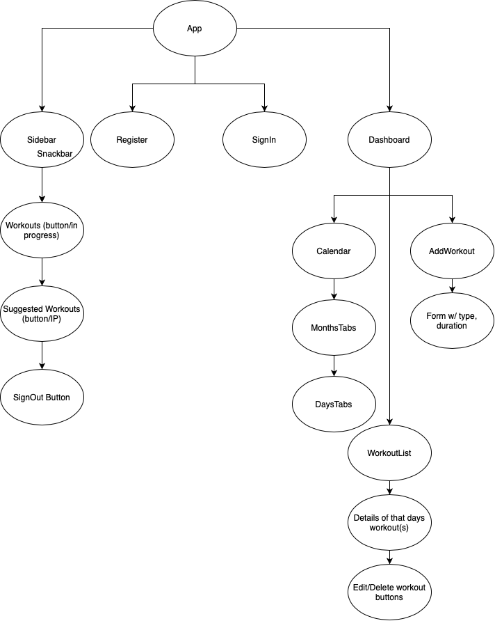

# fitBuddy

## A capstone project by: Zakkrey Short

### Last updated 20 May 2020

This project was bootstrapped with [Create React App](https://github.com/facebook/create-react-app).

## Wireframe

## User Stories

* User can visit application and sign-in.
* User can visit application and register an account.
* User can log out.
* User can select, _forgot password_ and get an email link to reset their account password.
* User can visit their dashboard(will house calendar and workouts).
* User can add a workout on a specific day.
* User can edit a workout.
* User can delete a workout.

## Technologies Used

* Javascript
* React
* Redux
* Node.js
* Firebase
* Context API

## Future Plans
* Add workout database for suggested workouts
* Add videos/pictures of example exercises
* Be able to update year to look at past progress
* Implement victory for data visualization (weight gain/loss over time)
* Implement scoreboard for longest run, most push ups, etc.

### License

[MIT](https://choosealicense.com/licenses/mit/)

Copyright &copy; 2020 **_Zakkrey Short_** 

#

## Capstone Proposal

fitBuddy- Your fitness tech pal
##### Description
A web application where a user can keep track of their workouts on a certain date. Repetitions, sets, weight used, and description of workouts done.
##### Use Case
Anyone and everyone can use this application. Whether it is a light jog, swim in the Willamette, or an olympian snatching hundred’s of pounds overhead, fitBuddy can help a user keep track of their progress over time. Keep track of your date of workout, length, type, and any movements done during that time! A lot of chances to add other tech such as API calls for maps or smart watch integration.
##### Minimum Viable Product
(List the absolute minimum features the project requires before it is considered in a pre-alpha state)
* User should be able to say whether they worked out in some fashion on a day. * User should be able to describe type of workout, with duration.
* User can list exercises with sets, distance, weight lifted, etc.
##### Tools for MVP
(List the tools, frameworks, libraries, APIs, modules, resources, languages, etc that will be used to create your MVP. Be specific.)
* JavaScript/React
* Firebase (authorization)
* Material UI for styling elements 
* Context API
##### Additional Features
(If you finish developing your MVP and have time to spare, what features do you want to work on next? Be specific.)
* User can create a profile to keep track of height and weight for BMI calculations. * Implements a daily calorie burner based off weight.
* Display different workout movements
* Visualization of body weight over the course of weeks/months * Deployment as mobile application
##### Tools for Additional Features
(List the tools, frameworks, libraries, APIs, modules, resources, languages, etc that will be used to create your additional features. Be specific.)
* Same languages, JS/React/, but add My/NoSQL for user integration.
* Apple Watch API/Context API
* Integrate social media sharing for a workout session. * Database of suggested workouts split by body part. * Victory library for data visualization
##### Additional Information
(Is there anything else you’d like your instructor to know?)
I think I have a good basis of where to start. I started looking ahead into using API and Database with our react projects to get an idea of what to expect. I am super stoked for this project!!

# 

## Resources

### Context API Docs

https://reactjs.org/docs/context.html

### Firebase Docs

https://firebase.google.com/docs/web/setup

### Material UI

https://material-ui.com

### JS Calendar

https://www.npmjs.com/package/rc-calendar

### Firebase AUTH

https://firebase.google.com/docs/auth

### React Calendar 

https://programmingwithmosh.com/react/build-a-react-calendar-component-from-scratch/

### Cloud Storage and creating Auth/Admin Pages

https://firebase.google.com/docs/functions/gcp-storage-events

### SO Article on Permissions

https://stackoverflow.com/questions/37403747/firebase-permission-denied

### SO Article on UID/getting user values

https://stackoverflow.com/questions/39542945/firebase-get-user-by-id

### React Components

https://www.codeinwp.com/blog/react-ui-component-libraries-frameworks/

### Material UI Typography

https://v3.material-ui.com/style/typography/#migration-to-typography-v2

### Converting timestamp to readable data

https://teamtreehouse.com/community/convert-timestamp-from-firebase-to-readable-date

### Snackbar for success alerts

https://bit.dev/mui-org/material-ui/snackbar

### Loading Icons

https://loading.io

### React Tables

https://github.com/tannerlinsley/react-table

### Fetching Data in React

https://blog.logrocket.com/patterns-for-data-fetching-in-react-981ced7e5c56/

### Dark Mode

https://www.smashingmagazine.com/2020/04/dark-mode-react-apps-styled-components/

## Alt dark mode hook

https://dev.to/smakosh/how-to-add-dark-mode-easily-with-a-custom-react-hook-10mj

# 

## Available Scripts

In the project directory, you can run:

### `npm start`

Runs the app in the development mode. 
Open [http://localhost:3000](http://localhost:3000) to view it in the browser.

The page will reload if you make edits. 
You will also see any lint errors in the console.

### `npm test`

Launches the test runner in the interactive watch mode. 
See the section about [running tests](https://facebook.github.io/create-react-app/docs/running-tests) for more information.

### `npm run build`

Builds the app for production to the `build` folder. 
It correctly bundles React in production mode and optimizes the build for the best performance.

The build is minified and the filenames include the hashes. 
Your app is ready to be deployed!

See the section about [deployment](https://facebook.github.io/create-react-app/docs/deployment) for more information.

### `npm run eject`

**Note: this is a one-way operation. Once you `eject`, you can’t go back!**

If you aren’t satisfied with the build tool and configuration choices, you can `eject` at any time. This command will remove the single build dependency from your project.

Instead, it will copy all the configuration files and the transitive dependencies (webpack, Babel, ESLint, etc) right into your project so you have full control over them. All of the commands except `eject` will still work, but they will point to the copied scripts so you can tweak them. At this point you’re on your own.

You don’t have to ever use `eject`. The curated feature set is suitable for small and middle deployments, and you shouldn’t feel obligated to use this feature. However we understand that this tool wouldn’t be useful if you couldn’t customize it when you are ready for it.

## Learn More

You can learn more in the [Create React App documentation](https://facebook.github.io/create-react-app/docs/getting-started).

To learn React, check out the [React documentation](https://reactjs.org/).

### Code Splitting

This section has moved here: https://facebook.github.io/create-react-app/docs/code-splitting

### Analyzing the Bundle Size

This section has moved here: https://facebook.github.io/create-react-app/docs/analyzing-the-bundle-size

### Making a Progressive Web App

This section has moved here: https://facebook.github.io/create-react-app/docs/making-a-progressive-web-app

### Advanced Configuration

This section has moved here: https://facebook.github.io/create-react-app/docs/advanced-configuration

### Deployment

This section has moved here: https://facebook.github.io/create-react-app/docs/deployment

### `npm run build` fails to minify

This section has moved here: https://facebook.github.io/create-react-app/docs/troubleshooting#npm-run-build-fails-to-minify
